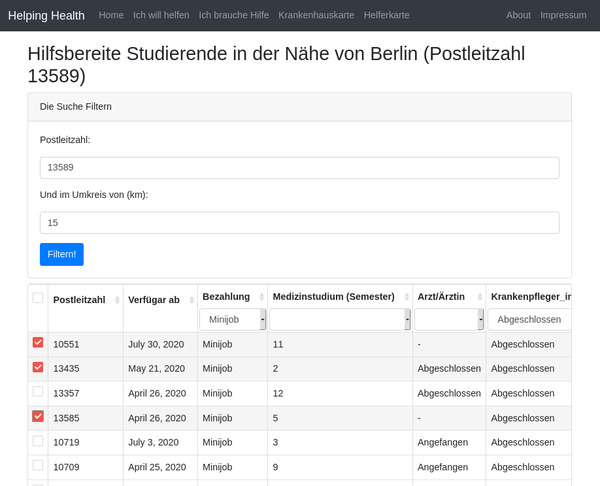
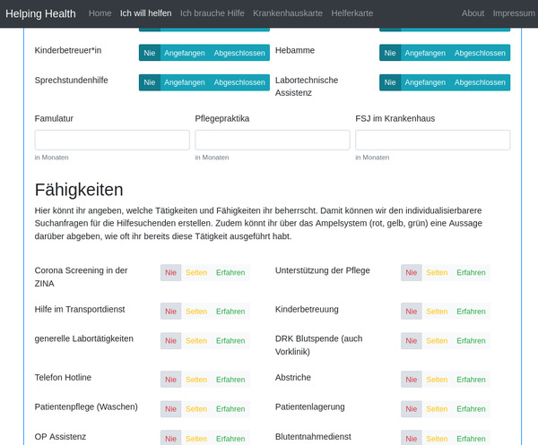

# [Helping Health](https://helping-health.from-de.com/) - #WirVsVirus Hackathon

Liebe Medizinstudierende, Freiwillige, Ärzte und Ärztinnen,
wir wollen euch über [diese Plattform](https://helping-health.from-de.com/) die Möglichkeit bieten, bei der Bewältigung der Coronakrise in Deutschland zu helfen. Unser Ziel ist es, den Krankenhäusern, Arztpraxen und Gesundheitsämtern in Deutschland einen Pool an Fachkräften bereitzustellen, die bereit sind, in Notsituationen auszuhelfen und wichtige Aufgaben zu übernehmen. Dabei wollen wir Menschen die helfen wollen ihren Erfahrungen und Fähigkeiten entsprechend einem Krankenhaus, einer Arztpraxis oder einem Gesundheitsamt zuweisen.

## An wen richtet sich Helping Health?

### An Menschen die helfen wollen

Du hast Erfahrung um in dieser Notsituation medinizisch helfen zu können? Du studierst medizin, hast bereits in der Pflege gearbeitet, bist Rettungssanitäter oder hast andere relevante Fähigkeiten? Dann kannst du dich hier bei [Helping Health](https://helping-health.from-de.com/iamstudent/student_registration) registrieren um kontaktiert zu werden, wenn deine Unterstützun gebraucht wird.

### An Gesundheitseinrichtungen die Unterstützung brauchen

Du arbeitest in einem Krankenhaus oder einer Praxis und brauchst Unterstützung um den Ansturm der nCOV-19 Patienten zu bewältigen? Du suchst gezielt Fachkräfte, welche dich bei deiner Arbeit im Gesundheitswesen unterstützen können? Einen Überblick
über bereits angemeldete Fachkräfte findest du hier bei [Helping Health](https://helping-health.from-de.com/mapview/)

___

# Technische Dokumentation

## Docker
### First start
- Build images and run containers
`docker compose-up`
- Apply migrations
`docker exec backend python3 manage.py migrate`
- Collect static files
`docker exec backend python3 manage.py collectstatic`
- load test data:
`docker exec backend python3 manage.py loaddata fixture.json`

### Development
File changes in python files trigger an auto-reload of the server.
Migrations have to be executed with `docker exec backend python3 /matchedmedisvirus-backend/manage.py migrate`.

After changes to the Docker configuration, you have to restart and build the containers with `docker compose-up --build`.

## local
- create migration after model change:
`python3 manage.py makemigrations`

- migrate to current version:
`python3 manage.py migrate`

- dump current database into fixture file (override fixture file):
`python3 manage.py dumpdata > fixture.json`

- load test data:
`python3 manage.py loaddata fixture.json`

## Translation
- Add translatable strings in python with `_("Welcome to my site.")` and import `from django.utils.translation import gettext as _` ([Documentation](https://docs.djangoproject.com/en/3.0/topics/i18n/translation/#internationalization-in-python-code))
- Add translatable strings in templates with `This string will have {{ value }} inside.` or alternatively with the `trans` block and include `` at the top ([Documentation](https://docs.djangoproject.com/en/3.0/topics/i18n/translation/#internationalization-in-template-code))
- Update the translation file
`django-admin makemessages -l en`
- Edit translations in `backend/locale/en/LC_MESSAGES/django.po`

## Production
Set `SECRET_KEY` in `backend.prod.env` for django and `POSTGRES_DB`, `POSTGRES_USER`, `POSTGRES_PASSWORD` for postgres on your host machine.
Start the system with `docker-compose -f docker-compose.dev.yml -f docker-compose.prod.yml up --build`.
